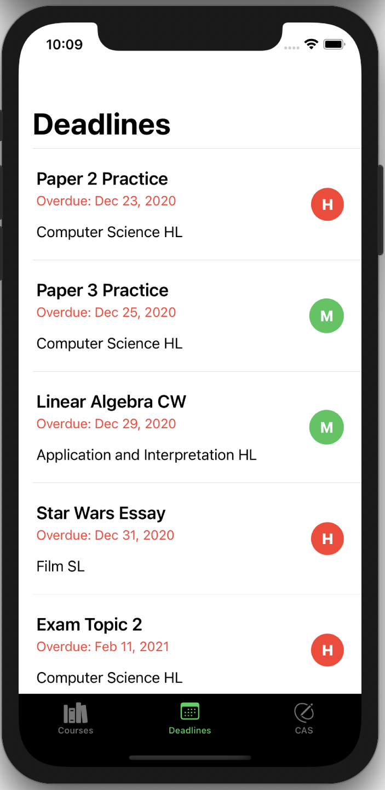
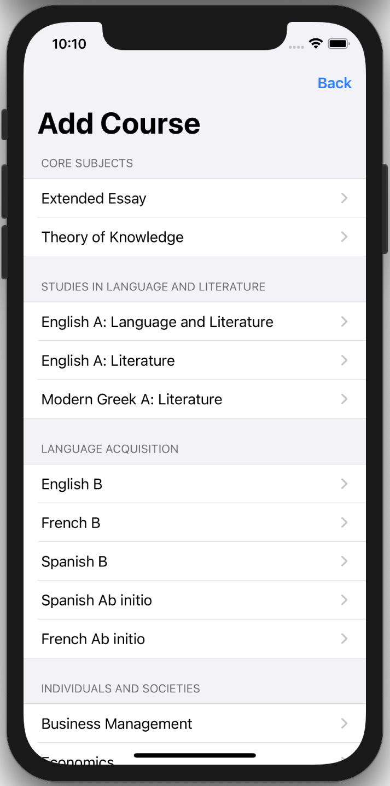
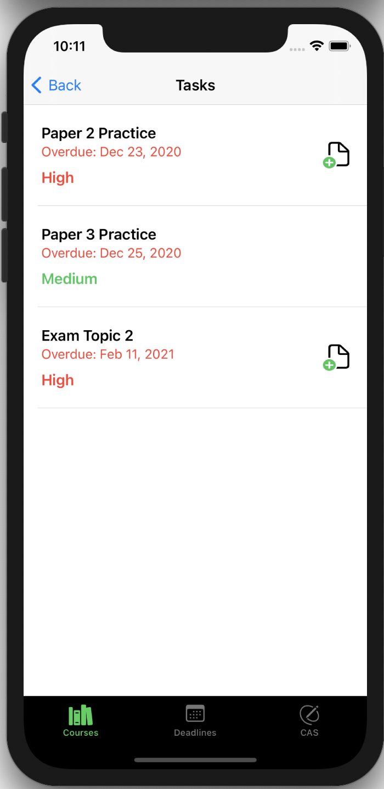
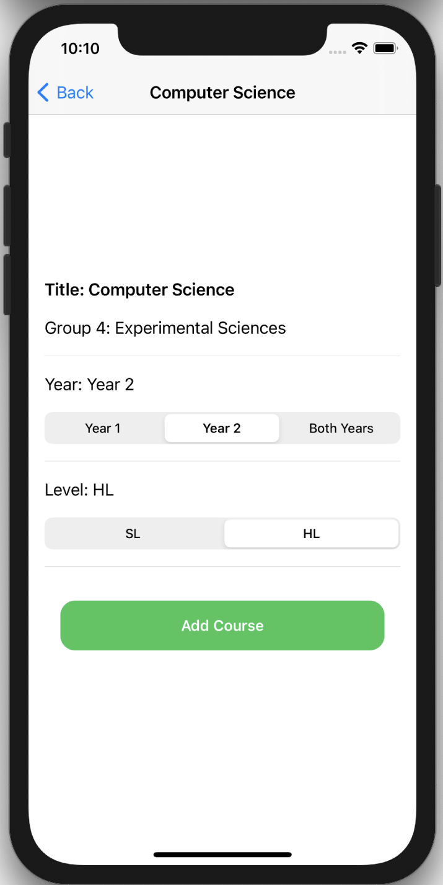

# CourseBuddy

A small iOS application for managing your International Baccalaureate program courses. Built using Swift, with **SwiftUI** and UIKit for the UI. The persistent storage layer is developed with **CoreData**.

**Technologies & Frameworks used:**

* SwiftUI
* UIKit 
* CoreData
* Xcode 12
* Swift 5.2 

## Sample Screens 

    
    
     
    
    

